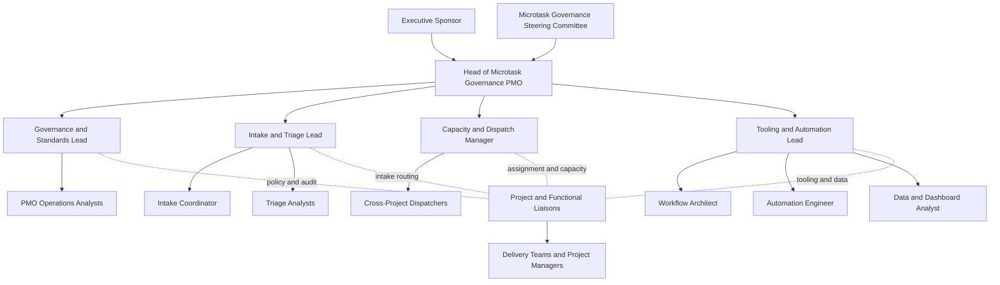

# Desain Organisasi PMO Untuk Microtask Governance Lintas Proyek

## Ringkasan eksekutif

PMO yang efektif, menurut PMI, bukan sekadar kantor administrasi, melainkan struktur manajemen yang menstandardisasi governance proyek dan memfasilitasi berbagi sumber daya, metodologi, alat, dan teknik; fungsi utamanya juga mencakup pengelolaan shared resources, pengembangan metode dan standar, audit kepatuhan, dokumentasi bersama, serta koordinasi komunikasi lintas proyek. PMI juga menekankan bahwa PMO yang paling efektif memprioritaskan value delivery di atas sekadar proses. Dengan premis itu, desain yang paling cocok untuk **microtask governance** bukan PMO tradisional yang hanya fokus milestone, melainkan **hybrid PMO–PSO–dispatch office**: satu unit kecil yang bertindak sebagai control tower, intake hub, capacity balancer, dan tooling intelligence layer untuk pekerjaan kecil yang tersebar di banyak proyek. citeturn24view0turn24view1turn23search0turn23search2turn23search9

Alasan bisnis untuk model ini kuat. Literatur HCI dan sosiologi kerja menunjukkan bahwa pekerja pengetahuan secara rutin menginterleaving banyak tugas, bahwa interupsi yang tidak tepat meningkatkan waktu pemulihan dan **resumption lag**, dan bahwa email menambah kerja reorientasi serta dapat meningkatkan stres. Studi organisasi juga menunjukkan bahwa interaksi spontan yang “membantu” sekalipun dapat memfragmentasi hari kerja dan mengurangi kendali atas jadwal. Dalam konteks portofolio, konsekuensinya adalah **hidden work**, overload yang tidak terlihat, backlog kecil yang tidak bertuan, dan data kapasitas yang bias. citeturn21view2turn21view3turn21view4turn21view5turn7search0

Karena itu, rekomendasi inti laporan ini adalah membentuk **PMO Microtask Governance** dengan tiga kapabilitas inti: **governance and standards**, **intake and triage**, dan **capacity, tooling, and automation**. Secara operasional, unit ini harus memaksa seluruh microtask melewati alur **intake → triage → assignment → execution → closure**, didukung oleh WBS yang bisa dipecah sampai detail yang memang dibutuhkan pengelolaan, RACI yang tegas, SLA berbasis priority lane, serta dashboard yang mengukur bukan hanya throughput tetapi juga hidden work, reopen rate, backlog aging, dan context-switching load. PMI secara eksplisit menyatakan bahwa WBS adalah dekomposisi hierarkis yang makin detail di setiap level, dan bahwa tidak boleh ada batas arbitrer tentang seberapa dalam WBS harus dipecah bila tingkat detail itu diperlukan untuk mengelola pekerjaan secara efektif. citeturn24view2turn25view0

Paket deliverable yang diminta sudah saya siapkan dalam bentuk ZIP, termasuk SOP, org chart, template, contoh dashboard, konfigurasi tooling, snippets automasi, roadmap 90 hari, dan risk register. Tautan unduhan ada pada bagian akhir laporan ini.

### Label epistemik

Klaim mengenai definisi PMO, WBS, RACI, dan kapabilitas Jira, Asana, ClickUp, Slack, serta email intake di bawah ini berbasis sumber resmi vendor, PMI, dan literatur. **Struktur organisasi target, job descriptions, SLA, KPI threshold, dan roadmap adalah rancangan inferensial** yang saya sintesis dari sumber-sumber tersebut; ini adalah desain yang dapat diimplementasikan, bukan kutipan standar tunggal. **Tidak ada simulated narrative.** Hal yang **tidak mungkin diverifikasi dengan kapabilitas saat ini** adalah kecocokan tenant-specific configuration di instance Jira/Asana/ClickUp milik Anda tanpa akses admin ke lingkungan tersebut.

## Basis riset dan logika desain

Secara konseptual, PMO microtask governance harus lahir dari dua fakta. Fakta pertama: PMO, menurut PMI, berfungsi untuk menstandardisasi governance, mengelola shared resources, mengembangkan methodology dan template, melakukan audit kepatuhan, dan mengoordinasikan komunikasi lintas proyek. Fakta kedua: pekerjaan pengetahuan modern sangat rentan pada switching, interruption, dan implicit work creation melalui chat, email, follow-up, dan coordination overhead. Jika PMO hanya mengendalikan deliverable besar, maka lapisan kerja kecil ini tetap tidak terlihat; jika PMO mengendalikan hingga terlalu detail tanpa mekanisme intake yang baik, organisasi tenggelam dalam administrasi. Jadi, desain yang tepat harus **memusatkan kontrol pada pekerjaan kecil yang berdampak lintas proyek, tetapi mengotomatisasi sebanyak mungkin bagian yang repetitif**. citeturn24view0turn24view1turn21view2turn21view3turn21view4

Rasional WBS sangat penting di sini. PMI mendefinisikan WBS sebagai “family tree” yang mengorganisasi dan mendefinisikan total scope; setiap level ke bawah memberi definisi yang makin rinci. Pada artikel praktik WBS, PMI juga menegaskan bahwa project manager berhak mendekomposisi hingga tingkat detail yang diperlukan untuk merencanakan dan mengelola proyek secara efektif, tanpa batas arbitrer. Ini memberi dasar metodologis untuk **menangkap microtasks sebagai work packages level rendah atau task records turunan**, selama tetap terkait ke parent project, parent deliverable, atau parent process. Dengan kata lain, microtask governance bukan penyimpangan dari praktik PMO; ia justru bentuk dekomposisi kontrol yang konsisten dengan PMI ketika kompleksitas koordinasi meningkat. citeturn24view2turn25view0

Faktor manusia juga mendukung kebutuhan ini. Studi Microsoft Research menunjukkan bahwa interupsi yang tidak tepat menaikkan waktu pemulihan tugas dan menciptakan resumption lag; studi lain menunjukkan email menciptakan pekerjaan tambahan untuk reorientasi dan dapat berkorelasi dengan stres; studi Perlow menunjukkan bahwa aktivitas interaktif yang mayoritas sebenarnya bisa dijadwalkan belakangan tetap sering muncul spontan dan memfragmentasi hari kerja. Dalam desain PMO, implikasinya sederhana: bila pekerjaan kecil tidak diberi ID, owner, SLA, dan jejak waktu, maka organisasi kehilangan kemampuan membedakan antara “true delivery work” dan “coordination residue”. citeturn21view3turn21view4turn21view5

Di level tooling, pasar saat ini sangat mendukung model tersebut. Jira/Jira Service Management menyediakan request types, form/request form, customizable work item view, email-to-request, custom fields, formula fields, configurable hierarchy, subtasks, time tracking, automation flows, incoming webhook trigger, smart values dari forms, dan Slack integration. Asana menyediakan forms untuk request intake, custom fields pada tasks, projects, dan portfolios, rules, portfolios, workload, native time tracking/timesheets add-on, email-to-task, Slack integration, dan webhooks via HTTP POST. ClickUp menyediakan hierarchy yang fleksibel, forms, custom fields by location, automations, email ClickApp, time tracking, time estimates, dashboards, dan workload/time reporting. Slack sendiri menyediakan Workflow Builder, forms, shortcuts, dan trigger/step governance yang membuatnya ideal sebagai **front-door intake**, bukan sebagai system of record utama. citeturn24view3turn24view4turn24view5turn24view6turn15view18turn19view7turn19view8turn18view3turn18view4turn24view7turn1search25turn4search0turn4search3turn4search30turn10search1turn14search0turn14search29turn11search0turn12search4turn18view5turn15view10turn15view11turn15view12turn24view8turn24view9turn17view3turn17view4turn17view5turn17view8turn15view13turn15view14turn24view10turn20view1turn20view2

## Model organisasi PMO

Desain yang paling defensible adalah **PMO Microtask Governance** sebagai overlay di atas PMO/EPMO yang sudah ada, bukan pengganti project manager. Unit ini saya rekomendasikan berfungsi sebagai kombinasi **control tower**, **project support office**, dan **resource dispatch office**. PMI sendiri membedakan fungsi PMO dan PSO: PMO cenderung mengarahkan alignment strategis dan reporting terpusat, sedangkan PSO menyediakan dukungan operasional harian untuk planning, monitoring, dan control. Untuk microtask governance, kedua fungsi itu perlu digabung dalam satu operating model kecil. citeturn23search10turn23search6turn23search14turn23search8

Org chart berikut memvisualisasikan model yang direkomendasikan, dengan satu kepala PMO yang membawahi empat stream inti dan menggunakan project/functional liaisons sebagai sambungan ke delivery teams.

### Peran inti dan deskripsi pekerjaan

| Peran | Mandat inti | Keputusan harian utama | Output kunci |
|---|---|---|---|
| Executive Sponsor | Memberi legitimasi, prioritas, dan keputusan lintas fungsi | Menyetujui escalations strategis dan policy exceptions | Charter, keputusan eskalasi, sponsor adopsi |
| Head of Microtask Governance PMO | Memimpin operating model end-to-end | Menyetujui SLA, taxonomy, cadence review, corrective actions | Control report portofolio, kebijakan, escalation governance |
| Governance and Standards Lead | Menjaga SOP, taxonomy, audit trail, definisi done | Menyetujui closure quality, policy changes, exception handling | SOP, audit findings, taxonomy dictionary |
| Intake and Triage Lead | Mengendalikan front-door dan klasifikasi kerja | Menentukan class, priority lane, accept/merge/escalate decision | Triage log, duplicate control, intake quality |
| Capacity and Dispatch Manager | Menyeimbangkan beban owner lintas proyek | Menentukan owner, accountable owner, due date committed | Assignment plan, blocked escalation, load balancing |
| Tooling and Automation Lead | Menjadikan tool sebagai single source of truth | Menyetujui workflow, field schema, automations, integration changes | Workflow map, automation rulebook, dashboard semantic layer |
| PMO Operations Analysts | Menjalankan backlog control harian | Menindak aging, missing fields, SLA breaches | Daily control pack, hygiene actions |
| Project and Functional Liaisons | Menjembatani PMO mikro dengan proyek/fungsi induk | Memvalidasi parent context, accountable owner, priority conflicts | Context validation, routing support |

Tabel di atas adalah **usulan desain**. Dasar desainnya berasal dari fungsi PMO menurut PMI—shared resources, methodology, audits, policies, documentation, dan cross-project communication—ditambah konsep PSO sebagai dukungan planning/monitoring, serta strategic PMO sebagai “central clearinghouse” data dan center of excellence. citeturn24view0turn23search0turn23search2turn23search9turn23search21

Secara staffing, struktur ini cocok dimulai sebagai **inti 6–9 FTE** untuk organisasi dengan volume kerja kecil yang sudah signifikan, ditambah liaison part-time di fungsi/proyek utama. Saya sengaja tidak merekomendasikan model yang lebih kecil dari itu bila targetnya benar-benar lintas proyek, karena pemisahan antara **triage**, **dispatch**, dan **tooling/data** penting untuk mencegah konflik kepentingan: orang yang mengklasifikasi pekerjaan tidak sebaiknya sekaligus menjadi bottleneck assignment dan admin tool.

## Model operasi end-to-end

### SOP, checklist, dan SLA

Rantai kendali yang disarankan adalah **intake → triage → assignment → execution → closure**. RACI diperlukan karena tujuan microtask governance bukan sekadar mencatat pekerjaan, melainkan menegaskan siapa yang **Responsible**, **Accountable**, **Consulted**, dan **Informed** untuk setiap tahap. Atlassian mendefinisikan RACI sebagai responsibility assignment matrix yang mengklarifikasi kepemilikan dan meminimalkan tumpang tindih tugas; itu sangat cocok untuk konteks microtasks yang sering ambigu. citeturn15view3

| Tahap | Owner proses | Kontrol utama | SLA baseline desain |
|---|---|---|---|
| Intake | Intake Coordinator | ID item unik, mandatory fields, project tag, source channel | P1: 1 jam; P2: 4 jam; P3: 1 hari kerja; P4: 3 hari kerja |
| Triage | Triage Analyst / Lead | Class of service, duplicate check, priority, escalate vs keep as microtask | sama dengan lane intake |
| Assignment | Capacity and Dispatch Manager | Owner, accountable owner, due date committed, load balance | P1: 4 jam; P2: 1 hari kerja; P3: 2 hari kerja; P4: batch mingguan |
| Execution | Task Owner | Worklog, blocker reason, dependency visibility, status cadence | update harian atau sesuai lane |
| Closure | Accountable Owner + PMO Ops | Evidence of done, actual effort, closure code, reopen control | review 0–2 hari kerja sesuai lane |

Tabel SLA di atas adalah **baseline inferensial**, bukan standar industri universal; saya merekomendasikan memakainya sebagai starting point lalu menyesuaikan setelah 6–8 minggu data aktual. Ia konsisten dengan kapabilitas tool modern: JSM menghubungkan request types ke work types dan workflows; Jira forms dapat memiliki field deskripsi dan field wajib; Jira dan JSM sama-sama mendukung email-to-work-item; Jira juga punya time tracking native untuk membandingkan estimasi vs actual. citeturn24view3turn24view4turn24view5turn15view15turn15view16turn24view6turn15view18

### Contoh RACI untuk alur inti

| Aktivitas | Requester | Intake Coordinator | Triage Analyst | Dispatch Manager | Task Owner | Accountable Owner | PMO Ops | Liaison |
|---|---|---|---|---|---|---|---|---|
| Submit request | R | A | I | I |  |  |  | C |
| Validate mandatory fields |  | R/A |  |  |  |  | C |  |
| Classify and prioritize |  |  | R | C |  | A | I | C |
| Assign owner and due date |  |  | C | R/A | C | C | I | C |
| Execute task |  |  |  |  | R | A | I | C |
| Log time and updates |  |  |  |  | R | A | C |  |
| Review closure evidence |  |  |  |  | R | A | C | C |
| Audit data quality |  |  |  |  |  |  | R | I |

RACI lengkap dalam format CSV ada di paket ZIP. Prinsip yang tidak boleh dikompromikan adalah: **setiap microtask harus punya satu Accountable Owner**, bukan hanya assignee teknis.

### WBS level-4 dan template minimum

Contoh WBS level-4 yang tepat untuk microtask governance bukan sekadar daftar subtask arbitrer, melainkan dekomposisi kontrol yang menjadikan pekerjaan kecil **bite-size pieces** yang masih terkait ke scope induk. PMI mendefinisikan WBS sebagai struktur hierarkis yang mengorganisasi total scope, dan artikel praktik WBS menyatakan bahwa kedalaman dekomposisi harus mengikuti kebutuhan pengelolaan. Karena itu, saya merekomendasikan WBS level-4 untuk fungsi operasi PMO mikro, misalnya: **Intake → Capture Channels → Mandatory Field Validation → Attachment Normalization**, lalu **Triage → Routing → Skill Pool Mapping → Dependency Tagging**, dan seterusnya. citeturn24view2turn25view0

Empat template minimum yang wajib ada adalah:

| Template | Fungsi kontrol | Field kunci |
|---|---|---|
| Intake Form | Menangkap kebutuhan mentah | summary, requester, project tag, requested-by date, impact, link pendukung |
| Backlog Item | Menjadi system-of-record | class, priority lane, owner, accountable owner, estimate, actual, closure code |
| Daily Log | Menangkap hidden work | MT ID, aktivitas, waktu, blocker, next step, deklarasi kerja >30 menit tanpa tiket |
| Weekly Review Agenda | Menjaga cadence governance | throughput, SLA, aging, overload, hidden work, reopen, duplicate, recurring candidates |

Tool-tool resmi mendukung desain ini. Asana forms memang ditujukan untuk menangkap dan menstreamline requests; custom fields tersedia pada tasks, projects, dan portfolios; portfolios dan workload memberi pandangan kapasitas lintas proyek; rules mengotomatisasi langkah berulang; email bisa diteruskan menjadi task; dan time tracking native/timesheets add-on tersedia. ClickUp forms mengumpulkan informasi dalam satu tempat; custom fields dapat dipasang pada List, Folder, Space, atau Workspace; hierarchy adalah struktur inti; automations dan Email ClickApp tersedia; time tracking dan time estimates native; dan dashboards mendukung visualisasi tracked time dan performance. citeturn1search25turn24view7turn4search30turn10search1turn4search0turn12search4turn14search0turn14search29turn15view10turn15view11turn15view12turn24view8turn17view3turn17view4turn24view9turn17view8

## KPI, tooling, dan automasi

### KPI dan dashboard metrics

Saya menyarankan dashboard PMO mikro tidak berhenti pada volume tiket. Minimum panel yang perlu ada adalah **intake completeness**, **triage SLA attainment**, **assignment SLA attainment**, **aging >14 hari**, **overdue red queue**, **hidden work ratio**, **reopen rate**, **duplicate rate**, **automation touchless rate**, dan **context-switching load index**. Threshold untuk semua metrik ini saya perlakukan sebagai **baseline desain**: misalnya hidden work ratio hijau bila ≤5 persen, reopen rate hijau bila ≤5 persen, aging >14 hari hijau bila ≤10 persen, dan context-switching load index hijau bila rata-rata ≤3 project tags unik per owner per hari. Threshold tersebut harus dituning menggunakan data internal setelah pilot. Kemampuan teknis untuk menghitung metrik itu memang tersedia: Jira formula fields dapat menghitung metrik pada work items; ClickUp dashboards dapat mengukur tracked time dan performance; Asana portfolio dashboards dan workload dapat menampilkan progress, trends, dan capacity; ClickUp time tracking dan time estimates juga native. citeturn15view5turn24view9turn17view1turn17view2turn17view3turn17view4turn17view5turn4search3turn10search1turn14search16

### Perbandingan opsi tooling

| Opsi | Kesesuaian untuk microtask governance | Kekuatan utama | Watchout utama | Bukti resmi |
|---|---|---|---|---|
| Jira + Jira Service Management | Sangat kuat bila organisasi butuh governance tinggi, email intake, dan audit trail formal | request types, request form/work item view, forms required fields, work type–workflow connection, email requests, time tracking, formula fields, hierarchy, automation, incoming webhook, Slack app | Administrasi lebih kompleks dan perlu admin discipline | citeturn24view3turn24view4turn24view5turn24view6turn15view18turn15view5turn19view7turn18view3turn18view4turn18view6 |
| Asana | Sangat baik bila prioritas utama adalah adopsi pengguna, request intake, dan portfolio/workload visibility | forms, custom fields pada tasks/projects/portfolios, rules, portfolios, workload, email-to-task, Slack integration, native time tracking/timesheets add-on, webhooks | Sebagian fitur tergantung plan/add-on dan implementasi governance perlu disiplin field design | citeturn1search25turn24view7turn4search0turn4search30turn4search3turn10search1turn14search0turn14search29turn11search0turn12search4turn18view5 |
| ClickUp | Sangat baik bila organisasi ingin satu workspace fleksibel dengan hierarchy, forms, dashboards, time control, dan email | hierarchy core, forms, custom fields by location, automations, Email ClickApp, dashboards, native time tracking, time estimates, rollups | Tanpa design governance yang ketat, hierarchy mudah menjadi terlalu longgar | citeturn24view8turn15view10turn15view11turn15view12turn24view9turn17view3turn17view4turn17view5turn17view8 |
| Slack + Email sebagai front-door | Sangat baik sebagai lapisan intake cepat, tidak cukup sebagai source of truth utama | shortcuts, workflows, forms, app actions, webhook-style triggers, integrasi ke tool PM | Jika dipakai sebagai sistem utama, governance dan audit trail akan lemah | citeturn15view13turn15view14turn24view10turn20view1turn20view2turn20view3turn15view15turn15view16 |

Secara praktis, saya menilai dua pola implementasi paling rasional. **Pola A**: JSM/Jira sebagai intake + system-of-record untuk organisasi yang sangat audit-heavy. **Pola B**: Asana atau ClickUp sebagai system-of-record, dengan Slack dan email sebagai intake surfaces, untuk organisasi yang lebih menekankan kecepatan adopsi dan workload visibility.

### Aturan automasi dan contoh scripts

Automasi yang paling bernilai bukan yang “pintar”, melainkan yang mencegah pekerjaan jatuh di sela-sela. Prioritas pertama adalah **auto-ID generation**, **mandatory-field gate**, **duplicate pre-screen**, **priority routing**, **SLA reminders**, **blocked escalation**, dan **closure evidence gate**. Jira Automation kini memakai istilah flow/step dan mendukung incoming webhook trigger; JSM forms menyediakan smart values untuk automation dan reporting; Asana webhooks mendorong event via HTTP POST; Jira webhooks dapat dipicu pada issues yang cocok dengan JQL query; Slack workflows dan shortcuts dapat menjalankan intake; dan ClickUp automations menyediakan triggers, actions, dan integration-powered automations. Semua itu cukup untuk membangun normalizer atau orchestration layer kecil yang platform-agnostic. citeturn19view6turn19view7turn19view8turn18view5turn18view6turn24view10turn20view1turn15view11

Paket ZIP menyertakan tiga snippets yang saya anggap minimum viable: **webhook normalizer** untuk menyatukan payload Slack/Jira/Asana/ClickUp/email, **email parser** untuk secondary intake, dan **SLA calculator** untuk menghitung attainment dari export CSV. Ini bukan integrasi production-ready, tetapi cukup untuk dipakai sebagai kerangka implementasi awal.

## Roadmap, risiko, dan paket ZIP

### Roadmap implementasi

Roadmap 90 hari yang saya rekomendasikan mempunyai logika berurutan: **define first, instrument second, automate third**. Fase awal harus mengunci definisi microtask, taxonomy, role boundaries, dan SLA sebelum mengonfigurasi tool. Setelah itu baru dibangun intake channels, queues, dashboards, dan rules; pilot dijalankan pada 2–3 tim; baru sesudah data cukup, threshold dan rules dituning.

| Fase | Fokus | Owner utama | Deliverable kunci |
|---|---|---|---|
| Minggu awal | Charter, staffing, taxonomy, SLA baseline | Sponsor + Head PMO | Charter, role roster, taxonomy v1 |
| Minggu desain | Field schema, workflow map, queue design | Tooling Lead + Governance Lead | Field dictionary, status map, RACI operational |
| Minggu build | Forms, Slack/email intake, dashboards v1 | Tooling Lead + Data Analyst | Intake channels aktif, daily control dashboard |
| Minggu pilot | Onboarding 2–3 tim, cadence review, wave-1 automation | Intake/Triage Lead + Dispatch Manager | Pilot pack, review minutes, rule tuning |
| Minggu stabilisasi | Audit kualitas data, rebalance capacity, wave-2 automation | Governance Lead + Tooling Lead | Audit log, assignment rule refinement |
| Akhir 90 hari | Keputusan scale-up | Steering Committee | 90-day report, policy refresh |

Roadmap detail dengan milestone mingguan, owners, dan exit criteria tersedia dalam file CSV di paket ZIP.

### Risk register ringkas

Empat risiko paling besar bukan teknis, melainkan organisasional. Pertama, **backlog tetap tidak lengkap** karena tim masih mengeksekusi kerja lewat chat/email tanpa membuat item; ini beresonansi langsung dengan literatur tentang interruption-driven hidden work. Kedua, **triage menjadi bottleneck** jika staffing terlalu tipis. Ketiga, **workflow dan field schema terlalu kompleks**, sehingga adopsi rendah dan data tidak lengkap. Keempat, **closure semu**, yakni item ditutup tanpa evidence yang memadai, yang lalu mendorong reopen rate. Risiko-risiko itu harus dimitigasi bukan dengan menambah proses tanpa batas, tetapi dengan shortcut intake, policy yang jelas, automasi minimum yang tepat, dan audit sampling berkala. citeturn21view3turn21view4turn21view5turn24view0turn24view5

### Manifest dan tautan unduhan

Paket ZIP yang diminta sudah tersedia di sini:

- [Unduh paket ZIP lengkap](sandbox:/mnt/data/PMO_Microtask_Governance_Package.zip)
- [Lihat SOP Markdown](sandbox:/mnt/data/pmo_microtask_governance_package/01_SOP_microtask_governance.md)
- [Lihat SOP PDF](sandbox:/mnt/data/pmo_microtask_governance_package/01_SOP_microtask_governance.pdf)
- [Lihat org-chart PNG](sandbox:/mnt/data/pmo_microtask_governance_package/governance/02_ORG_CHART.png)
- [Lihat manifest file](sandbox:/mnt/data/pmo_microtask_governance_package/12_MANIFEST.csv)

Isi paket meliputi SOP, org chart dalam Mermaid/SVG/PNG, job descriptions, RACI CSV, WBS level-4 CSV, template intake/backlog/daily log/weekly review, definisi KPI, contoh dataset dashboard CSV/JSON, perbandingan tooling, contoh konfigurasi Jira/Asana/ClickUp, panduan integrasi Slack/email, snippets automasi, roadmap 90 hari, risk register, dan sources register.

### Open questions dan limitations

Ada dua batasan yang perlu dinyatakan eksplisit. Pertama, **fit akhir terhadap tenant Anda**—misalnya permission scheme Jira, availability add-on Asana, atau role limits ClickUp—tidak dapat saya verifikasi tanpa akses ke environment Anda sendiri. Ini penting karena beberapa fitur resmi memang bervariasi menurut plan, user role, atau subscription policy di Slack, Asana, dan ClickUp. Kedua, paket ini menyertakan model yang sengaja **tool-agnostic**, sehingga beberapa naming field dan status perlu disesuaikan saat dipetakan ke instansi Anda. citeturn15view10turn17view0turn20view1turn20view2

Secara keseluruhan, kesimpulan risetnya tegas: bila organisasi Anda benar-benar ingin “menangkap semua pekerjaan kecil lintas proyek”, maka solusi yang paling efektif bukan sekadar menambah board atau meminta tim lebih disiplin, melainkan membangun **PMO mikro yang punya front-door intake, triage yang eksplisit, dispatcher kapasitas, dan instrumentation layer**. Tanpa itu, hidden work akan terus muncul sebagai noise; dengan itu, hidden work berubah menjadi data kendali portofolio.